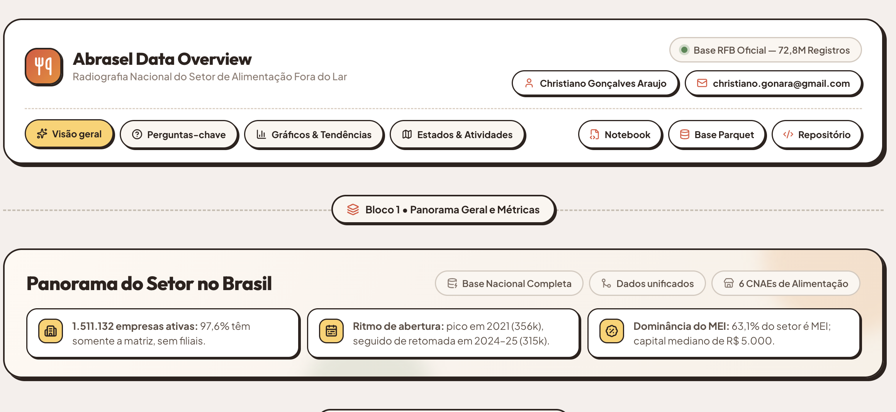
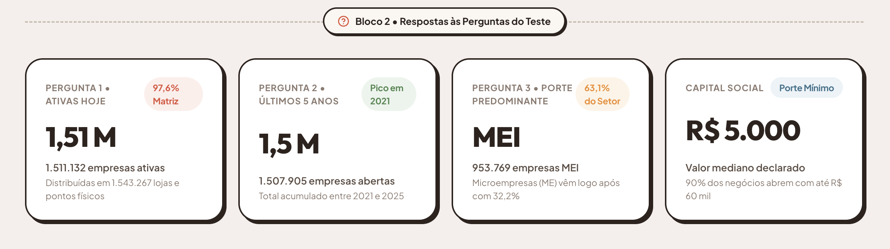
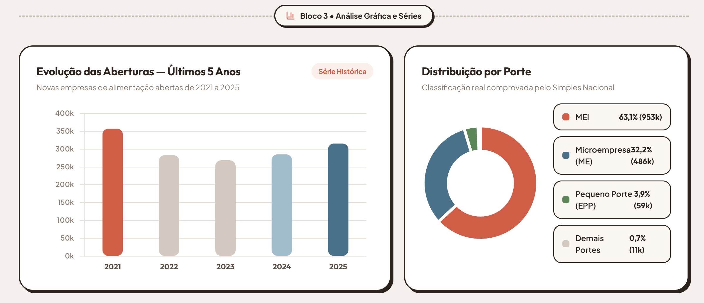
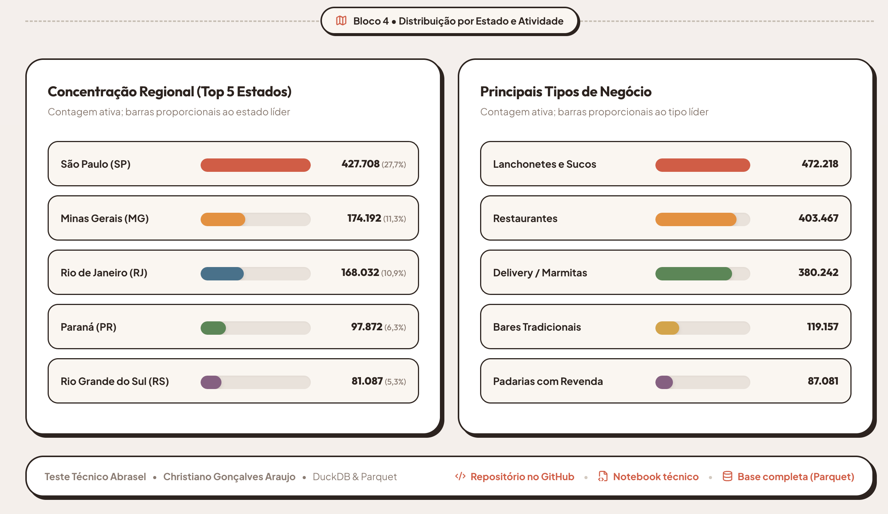
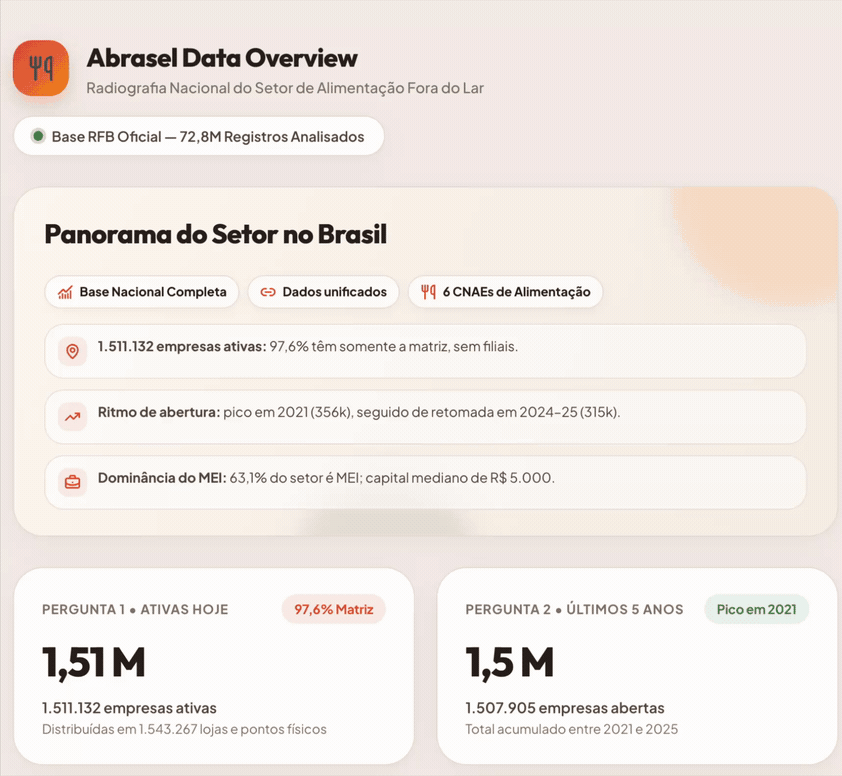

# Teste técnico Abrasel

Análise nacional do setor de bares, restaurantes e alimentação fora do lar, usando os dados abertos de CNPJ da Receita Federal (competência 2026-08).

[**Abrir dashboard publicado**](https://christiano-gonara.github.io/teste-abrasel-dados/) · [**Ver notebook técnico**](notebooks/analise_abrasel.ipynb) · [**Baixar base tratada (Parquet)**](https://github.com/christiano-gonara/teste-abrasel-dados/releases/latest)

## Dashboard executivo

<table>
  <tr>
    <td width="50%" valign="top"><br><sub><b>01 · Panorama nacional</b><br>Identidade, cabeçalho e métricas iniciais.</sub></td>
    <td width="50%" valign="top"><br><sub><b>02 · Perguntas-chave</b><br>Cards com as respostas obrigatórias do teste.</sub></td>
  </tr>
  <tr>
    <td width="50%" valign="top"><br><sub><b>03 · Gráficos & tendências</b><br>Série histórica de aberturas e rosca por porte.</sub></td>
    <td width="50%" valign="top"><br><sub><b>04 · Estados & atividades</b><br>Concentração regional e principais tipos de negócio.</sub></td>
  </tr>
</table>

## Navegação do dashboard



## Respostas do teste

| Pergunta | Resposta |
|---|---|
| Quantas empresas do setor estão ativas hoje? | **1.511.132 empresas** ativas, em 1.543.267 estabelecimentos. |
| Como evoluiu a abertura nos últimos 5 anos? | **1.507.905 empresas abertas** entre 2021 e 2025. O pico foi em 2021 (356.849) e 2025 encerrou com 315.376 aberturas. |
| Qual é o porte predominante? | **MEI: 63,1%** das empresas ativas; Microempresa (ME): 32,2%; EPP: 3,9%. |

## Entregáveis

- [`index.html`](index.html): dashboard executivo para leitura rápida.
- [`notebooks/analise_abrasel.ipynb`](notebooks/analise_abrasel.ipynb): análise técnica executada, com código, respostas e gráficos.
- [`scripts/01_ingestao.py`](scripts/01_ingestao.py) e [`scripts/02_tratamento.py`](scripts/02_tratamento.py): ingestão, limpeza, junção e geração da base.
- [`dados/amostra/amostra_base_afl.csv`](dados/amostra/amostra_base_afl.csv): amostra pública com 20 mil linhas.
- [Release](https://github.com/christiano-gonara/teste-abrasel-dados/releases/latest): base nacional completa em Parquet.

## Decisões técnicas

- Foram processadas as **10 partes nacionais** de Empresas e Estabelecimentos: uma parte isolada não cobre os cinco anos de forma confiável.
- O MEI foi identificado pela tabela do **Simples Nacional**, pois não aparece no campo de porte padrão da Receita.
- **DuckDB + Parquet** foram usados para tratar 72,8 milhões de estabelecimentos sem carregar toda a base na memória.

<details>
<summary>Como reproduzir</summary>

```bash
uv venv --python 3.11 .venv
uv pip install --python .venv/bin/python pandas duckdb matplotlib jupyter pyarrow
.venv/bin/python scripts/01_ingestao.py
.venv/bin/python scripts/02_tratamento.py
```

Os arquivos públicos devem ser baixados do [portal de dados abertos da Receita Federal](https://arquivos.receitafederal.gov.br/index.php/s/gn672Ad4CF8N6TK?dir=/Dados/Cadastros/CNPJ) para `dados/brutos/` antes de executar o pipeline.

</details>
